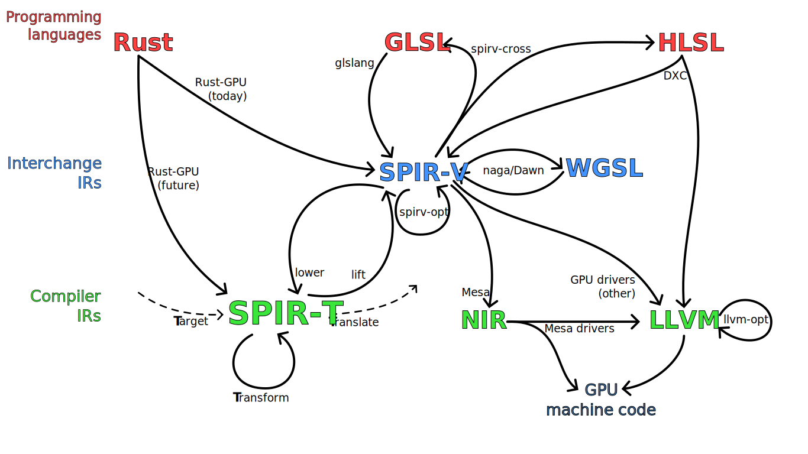

<!-- Allow this file to not have a first line heading -->
<!-- markdownlint-disable-file MD041 no-emphasis-as-heading -->

<!-- inline html -->
<!-- markdownlint-disable-file MD033 -->

<div align="center">

# `SPIR-🇹`

**⋯🢒 🇹arget 🠆 🇹ransform 🠆 🇹ranslate ⋯🢒**

[](https://embark.dev)
[](https://crates.io/crates/spirt)
[](https://docs.rs/spirt)
[](https://embarkstudios.github.io/spirt/spirt/index.html)
[](https://deps.rs/repo/github/EmbarkStudios/spirt)
[](https://github.com/EmbarkStudios/spirt/actions)
</div>

**SPIR-🇹** is a research project aimed at exploring shader-oriented IR designs derived from SPIR-V, and producing a framework around such an IR to facilitate advanced compilation pipelines, beyond what existing SPIR-V tooling allows for.

Such a need arose in the [Rust-GPU] project, which requires a variety of legalization passes to turn general-purpose (Rust<sup>1</sup>) code operating on *untyped* memory, into GPU-friendly direct data-flow.  
Our goal is to replace the existing [Rust-GPU] SPIR-V legalizations passes with **SPIR-🇹** equivalents - but even more imporantly, **SPIR-🇹** should allow writing much more powerful legalization/optimization passes, that would've been unfathomable<sup>2</sup> for direct SPIR-V manipulation.

---

<sub><sup>1</sup> Rust is not unique in its needs here, and more languages (or IRs) could eventually make use of such a framework, but the initial design and implementation work has focused on [Rust-GPU]</sub>

<sub><sup>2</sup> not outright impossible, but requiring excessive development/maintenance cost, having to constantly balance correctness and power (more conservative passes are easier to trust), etc.</sub>

## Disclaimer

This project is not affiliated, associated, authorized, endorsed by, or in any way officially connected with Khronos Group Inc., or any of its subsidiaries or its affiliates. The official Khronos Group Inc. website can be found at https://www.khronos.org.  
The names SPIR, SPIR-V, as well as related names, marks, emblems and images are trademarks of their respective owners.

<sub><i>Additional context: the name of this project is a pun on SPIR-V, and entirely unrelated to SPIR (the older IR standard).</i></sub>

## Status

🚧 *This project is in active design and development, many details can and will change* 🚧

If you're interested in using **SPIR-🇹** yourself, you may want to first take a look at [the issue tracker](https://github.com/EmbarkStudios/spirt/issues) for relevant issues, and even open new ones describing your usecase.  
With the initial focus being on [Rust-GPU]'s usecase, various (otherwise desirable) functionality/APIs/docs may be lacking, or rapidly changing - at the same time, discussions around widening the scope and usability of **SPIR-🇹** _in the long term_ are still welcome.

### Non-goals (at least in the short term)

* supporting the ("OpenCL") `Kernel` dialect of SPIR-V
  * `Kernel` SPIR-V is much closer to LLVM IR, than `Shader` SPIR-V, and
    as such tooling oriented around LLVM is more likely to be a better fit
* textual syntax that can be parsed back
  * i.e. the pretty-printer output is purely a visualization

### Designed and implemented so far

<table>
<tr><td width="50%">

**IR data types**:
* allowing near-arbitrary SPIR-V instructions for any unrecognized opcodes
  * IDs are replaced with interned/"entity" handles (see below)
* interning for attributes (decorations & similar), types and constants
  * i.e. automatic deduplication, efficient indexing, and no concept of "definition"
    (only uses of interned handles can lead to a module being considered to contain a specific type/constant)
* "entity" system for e.g. definitions in a module, instructions in a function, etc.
  * disallows iteration in favor of/forcing the use of efficient indexing
* structured control-flow "regions" inspired by RVSDG, stricter than SPIR-V
  (see `ControlRegionDef`'s docs for more details)

</td><td>

**Framework utilities**:
* `visit`/`transform`: immutable/mutable IR traversal
* `print`: pretty-printer with (styled and hyperlinked) HTML output

**Passes (to/from/on SPIR-🇹)**:
* `spv::lower`: "lowering" from SPIR-V, normalizing away many irrelevant details
  * lossy for some relevant details (these are bugs, though many are non-semantic so lower priority)
* `spv::lift`: "lifting" back up to SPIR-V, making arbitrary choices where necessary
  * comparable to e.g. generating GLSL syntax from SPIR-V, just one level down
* `cfg::Structurizer`: (re)structurization, from arbitrary control-flow to the stricter structured "regions"
* `passes::link`: mapping (linkage) imports to relevant exports

</td></tr></table>

## Simple example (with non-trivial control-flow)

<table>
<tr><td>

<div align="center">

**GLSL** ([`for-loop.vert.glsl`](tests/data/for-loop.vert.glsl))</div>
<sup>

```glsl
#version 450
out int output0;
void main() {
    int o = 1;
    for(int i = 1; i < 10; i++)
    	  o *= i;
    output0 = o;
}
```
</sup>
<div align="center">

**WGSL** ([`for-loop.wgsl`](tests/data/for-loop.wgsl))</div>
<!--FIXME(eddyb) this is WGSL but GitHub can't syntax-highlight it yet -->
<sup>

```glsl
@vertex
fn main() -> @location(0) i32 {
    var o: i32 = 1;
    for(var i: i32 = 1; i < 10; i++) {
    	o *= i;
    }
    return o;
}
```
</sup>
</td><td>

<!--FIXME(eddyb) link to GH pages having a `.spirt.html` render of this -->
<div align="center">

**SPIR-🇹**</div>
<!--FIXME(eddyb) this is SPIR-T but GitHub can't syntax-highlight it (ever?) -->
<sup>

<!-- NOTE(eddyb) BEGIN/END below processed by .github/workflows/check-examples.sh -->
<!-- BEGIN tests/data/for-loop.wgsl.spvasm.structured.spirt -->
```cxx
#[spv.Decoration.Flat]
#[spv.Decoration.Location(Location: 0)]
global_var GV0 in spv.StorageClass.Output: s32

func F0() -> spv.OpTypeVoid {
  loop(v0: s32 <- 1s32, v1: s32 <- 1s32) {
    v2 = spv.OpSLessThan(v1, 10s32): bool
    (v3: s32, v4: s32) = if v2 {
      v5 = spv.OpIMul(v0, v1): s32
      v6 = spv.OpIAdd(v1, 1s32): s32
      (v5, v6)
    } else {
      (spv.OpUndef: s32, spv.OpUndef: s32)
    }
    (v3, v4) -> (v0, v1)
  } while v2
  spv.OpStore(Pointer: &GV0, Object: v0)
}
```
<!-- END tests/data/for-loop.wgsl.spvasm.structured.spirt -->
</sup>
</td><td>

<div align="center">

**SPIR-V** ([`for-loop.wgsl.spvasm`](tests/data/for-loop.wgsl.spvasm))</div>
<!--FIXME(eddyb) this is SPIR-V assembly but GitHub can't syntax-highlight it yet -->
<sup>

```llvm
%typeof_output0 = OpTypePointer Output %i32
%output0 = OpVariable %typeof_output0 Output

%typeof_main = OpTypeFunction %void
%main = OpFunction %void None %typeof_main
  %entry = OpLabel
    OpBranch %bb0
  %bb0 = OpLabel
    OpBranch %bb1
  %bb1 = OpLabel
    %o = OpPhi %i32 %1_i32 %bb0 %o_next %bb5
    %i = OpPhi %i32 %0_i32 %bb0 %i_next %bb5
    OpLoopMerge %bb6 %bb5 None
    OpBranch %bb2
  %bb2 = OpLabel
    %cond = OpSLessThan %bool %i %10_i32
    OpSelectionMerge %bb4 None
  OpBranchConditional %cond %bb4 %bb3
  %bb3 = OpLabel
    OpBranch %bb6
  %bb4 = OpLabel
    %o_next = OpIMul %i32 %o %i
    OpBranch %bb5
  %bb5 = OpLabel
    %i_next = OpIAdd %i32 %i %1_i32
    OpBranch %bb1
  %bb6 = OpLabel
    OpStore %output0 %o
    OpReturn
OpFunctionEnd
```
</sup>
</td></tr></table>

## GPU (shader) IR landscape overview
*(and the vision of how **SPIR-🇹** fits into it)*



The distinction being made here is between:
* **Interchange IRs** (standards that many tools can use to interoperate)
  * SPIR-V was very much intended as such a standard
    (outside of the GPU space, wasm is also a great example)
  * they only need to encode the right concepts, not straying too far away from what tools understand, but the design effort is often oriented around being a "serialization" format
* **Compiler IRs** (non-standard implementation details of compilers)
  * LLVM is quite well-known, but Mesa's NIR is even closer to **SPIR-🇹**
    (both being shader-oriented, and having similar specialized choices of e.g. handling control-flow)
  * these _have to_ handle legalization/optimization passes quite well, and in general a lot of on-the-fly transformations - as their main purpose is to _expedite_ such operations
  * this is where **SPIR-🇹** sits, as a kind of "relative"/dialect of SPIR-V, but making trade-offs in favor of the "intra-compiler" usage

## Contribution

[](CODE_OF_CONDUCT.md)

We welcome community contributions to this project.

Please read our [Contributor Guide](CONTRIBUTING.md) for more information on how to get started.
Please also read our [Contributor Terms](CONTRIBUTING.md#contributor-terms) before you make any contributions.

Any contribution intentionally submitted for inclusion in an Embark Studios project, shall comply with the Rust standard licensing model (MIT OR Apache 2.0) and therefore be dual licensed as described below, without any additional terms or conditions:

### License

This contribution is dual licensed under EITHER OF

- Apache License, Version 2.0, ([LICENSE-APACHE](LICENSE-APACHE) or <http://www.apache.org/licenses/LICENSE-2.0>)
- MIT license ([LICENSE-MIT](LICENSE-MIT) or <http://opensource.org/licenses/MIT>)

at your option.

For clarity, "your" refers to Embark or any other licensee/user of the contribution.

[Rust-GPU]: https://github.com/EmbarkStudios/rust-gpu
