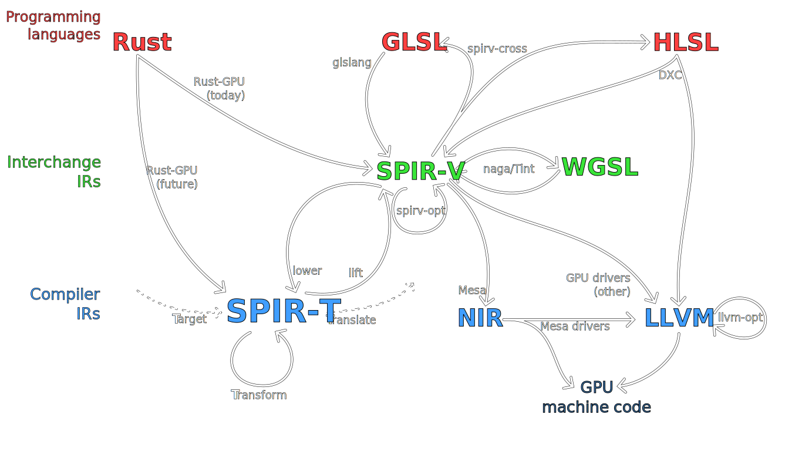

<!-- Allow this file to not have a first line heading -->
<!-- markdownlint-disable-file MD041 no-emphasis-as-heading -->

<!-- inline html -->
<!-- markdownlint-disable-file MD033 -->

# `SPIR-🇹`

**⋯🢒 🇹arget 🠆 🇹ransform 🠆 🇹ranslate ⋯🢒**

**SPIR-🇹** is a research project aimed at exploring shader-oriented IR designs derived from SPIR-V, and producing a framework around such an IR to facilitate advanced compilation pipelines, beyond what existing SPIR-V tooling allows for.

This need arose in the [Rust-GPU](https://github.com/EmbarkStudios/rust-gpu) project, which requires a variety of legalization transformations to turn general-purpose code operating on *untyped* memory, into GPU-friendly direct data-flow.
Rust is not unique in its needs here, and more languages (or IRs) could eventually make use of such a framework, but the initial design and implementation work has focused on [Rust-GPU](https://github.com/EmbarkStudios/rust-gpu).

## Status

🚧 *This project is in active design and development, many details can and will change* 🚧

### Designed and implemented so far

**IR datatypes**:
* allowing near-arbitrary SPIR-V instructions for any unrecognized opcodes
  * IDs are replaced with interned/"entity" handles (see below)
* interning for attributes (decorations & similar), types and constants
  * i.e. automatic deduplication, efficient indexing, and no concept of "definition"
    (only uses of interned handles can lead to a module being considered to contain a specific type/constant)
* "entity" system for e.g. definitions in a module, instructions in a function, etc.
  * disallows iteration in favor of/forcing the use of efficient indexing
* structured control-flow "regions" inspired by RVSDG, stricter than SPIR-V
  (see `ControlRegionDef`'s docs for more details)

**Framework utilities**:
* `visit`/`transform`: immutable/mutable IR traversal
* `print`: pretty-printer with (syntax-highlighted and hyperlinked) HTML output

**Passes (to/from/on SPIR-🇹)**:
* `spv::lower`: "lowering" from SPIR-V, normalizing away many irrelevant details
  * lossy for some relevant details (these are bugs, though many are non-semantic so lower priority)
* `spv::lift`: "lifting" back up to SPIR-V, making arbitrary choices where necessary
  * comparable to e.g. generating GLSL syntax from SPIR-V, just one level down
* `cfg::Structurizer`: (re)structurization, from arbitrary control-flow to the stricter structured "regions"
* `passes::link`: mapping (linkage) imports to relevant exports

<!--
## Quick example

**TODO(eddyb) compare GLSL/SPIR-V/WGSL/SPIR-T, likely for something w/ a simple loop + conditionals**
-->

## GPU (shader) IR landscape overview
*(and the vision of how SPIR-T fits into it)*

The distinction being made here is between:
* **Interchange IRs** (standards that many tools can use to interoperate)
  * SPIR-V was very much intended as such a standard
    (outside of the GPU space, wasm is also a great example)
  * they only need to encode the right concepts, not straying too far away from what tools understand, but the design effort is often oriented around being a "serialization" format
* **Compiler IRs** (non-standard implementation details of compilers)
  * LLVM is quite well-known, but Mesa's NIR is even closer to **SPIR-🇹**
    (both being shader-oriented, and having similar specialized choices of e.g. handling control-flow)
  * these _have to_ handle legalization/optimization passes quite well, and in general a lot of on-the-fly transformations - as their main purpose is to _expedite_ such operations
  * this is where **SPIR-🇹** sits, as a kind of "relative"/dialect of SPIR-V, but making trade-offs in favor of the "intra-compiler" usage

## Contribution

We welcome community contributions to this project.

Please read our [Contributor Guide](CONTRIBUTING.md) for more information on how to get started.
Please also read our [Contributor Terms](CONTRIBUTING.md#contributor-terms) before you make any contributions.

Any contribution intentionally submitted for inclusion in an Embark Studios project, shall comply with the Rust standard licensing model (MIT OR Apache 2.0) and therefore be dual licensed as described below, without any additional terms or conditions:

### License

This contribution is dual licensed under EITHER OF

- Apache License, Version 2.0, ([LICENSE-APACHE](LICENSE-APACHE) or <http://www.apache.org/licenses/LICENSE-2.0>)
- MIT license ([LICENSE-MIT](LICENSE-MIT) or <http://opensource.org/licenses/MIT>)

at your option.

For clarity, "your" refers to Embark or any other licensee/user of the contribution.
